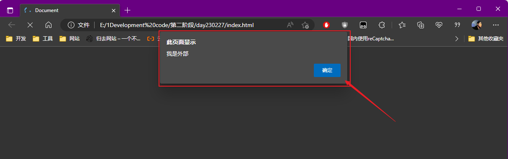
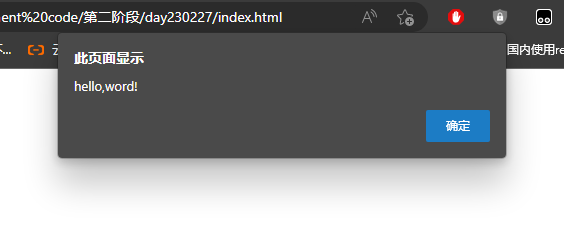
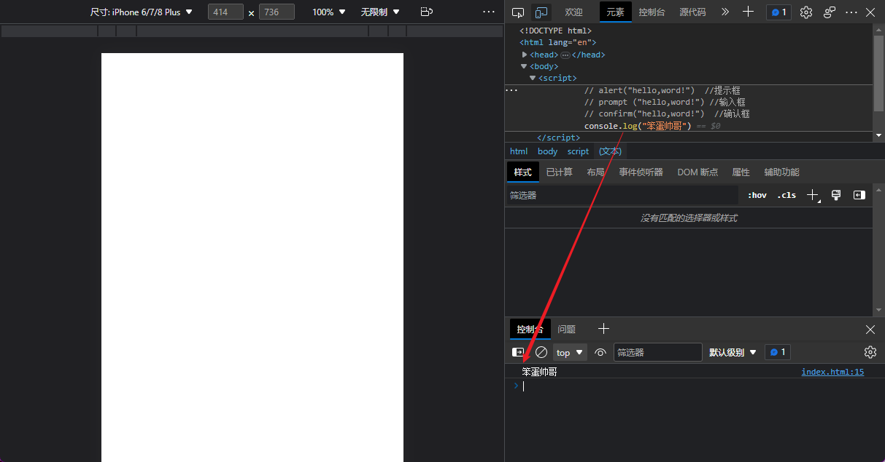
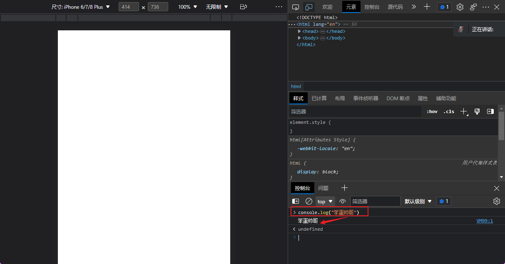

# 第二阶段-JavaScript学习笔记

[TOC]

------

## 讲师-冷剑

3年开发 8年教学
少讲多练 韩顺平
听懂没懂 看懂=没懂 操作
特长
打法 讲法
游戏
成功
开心 去做一件事情
学会 玩游戏

HTML5
休息 12点 12点
课程：
JavaScript 7周 前端 没学
非常多 大
重要 重要技巧性
难度：HTML 1 css 2 js 5 Vue 3 React 4

状态 10.5
三、对大家的建议
劳逸结合（注意睡眠）、注重操作（上课）帮助记忆、有意识记忆、无意识记忆（外界条件促发）、数理化（做题）、计算机课程 操作、
上课方式：制度、提问：多思考5、多交流5、多询问5
学习小组解决
纪律 举手示意 适当礼让 多经历
作业
晚自习 6：50~9：10
下课 10：30~10：55
3：30~3：55
5：00~5：15

------

## 第一章 JavaScript

### 一、基本概念

**1、概念**

> 基于对象和事件驱动的解释性脚本语言


（1）.语言
用于交流的工具
（2）. 计算机语言
和计算机交流的工具
C、C++ 、 python 、Java、C# SQL
（3）.脚本
本身不能独立运行，必须嵌入其他语言中，才可以运行。

**2、用途**
（1）.提供强大指令
（2）.能够运算
A.运算
对数据进行的任何操作，都叫运算
B.数据
凡是能够被计算机识别的一切符号，都是数据
（3）.能够让标签复活
在js里 标签、人、节点 、元素都是一个意思
把外界条件放到标签里面

**3、写法**
1.内部写法

```html

<html>
<head></head>
<body></body>
<script>
    alert("haoll,word!");
    confirm("haoll,word!")
    prompt("同志们，辛苦了！") /
</script>
</html>
```

2.外部写法

```html

<html>
<head></head>
<body></body>
<script src="1.js">
</script>
</html>
```

```javascript
alert("我是外部")
```


3.内嵌式写法

直接写在标签中的事件里面

```html

<html lang="en">
<head>
    <title>Document</title>
</head>
<body>
<h1 onclick="alert(`点我干嘛`)">张三</h1>
</body>
</html>
```

### 二、基本指令

#### （一）. 框

1. alert：提示框



2. confirm；确认框


3. prompt；输入框


4. console.log:在控制台打印消息

在网页文件中写


在浏览器里面输入


5. document.weite:在网页中打印

#### (二)this：事件源

1. 修改样式
   this.style.样式表属性名=属性值
2. 修改属性
   this.属性名=属性值

#### （三）高级指令

1. typeof:查看数据类型
   typeof(数据)
   例如：Console.loh()

### 三、基本事件

> 在JavaScript中所有的外界条件都称为事件
> **格式**
> 事件名=“js指令”

#### （一）鼠标

1. onclick:鼠标单击

2. ondblclick：鼠标双击

3. onmouseover：鼠标覆盖

4. onmouseout：鼠标离开

#### （二）键盘

5. onkeydown:键盘按下

6. onkeyup:键盘弹启

#### （三）表单

    onfocus ：获得焦点
    onblur:失去焦点
    oninput：输入内容
    onchange:状态改变

#### （四）注释

1. 单行注释

> 以//开头

2. 多行注释

> 以 /* 开头，以*/结尾

------

## 第二章 JavaScript语法

### 一、变量

#### （一）概念

> 计算机中用于储存数据的一种工具一个变量只能储存一个数据

#### （二）操作

1. 定义 （var）
   var 变量名；
2. 存数据（=）
   变量名=数据；a=5；
3. 提取数据（变量名）
   直接写变量名即可
   document.write(变量名);
   注意事项：提取变量中的数据时，计算机是把变量中的数据复制一份提取出来
   4.变量的初始化
   在定义变量的同时，给她一个初始值 var a=5;

### 二、数据类型以及转换

#### （一）数据类型

1.基本类型
（1）string 字符串 必须用英文的引号（单引号和双引号都可以）引起来
（2）number ： 数字 直接写数字即可
（3）boolean 类型 只有两个值 true(成立)和false（不成立）
2.特殊类型
（1）null:空
（2）undefined：未定义 定义了一个变量，但没有赋值，变量中内容就是undefined
3.复杂（对象）类型
（1）object
{}

#### （二）数据类型的转换

1.字符串转数字
（1）parselnt
格式:parselnt(str)
str 是·个字符串
例如:parselnt(“555”) 结果为:555
注意事项:Parselnt 不会保留
(2). parseFloat
格式: parseFloat(str)   str 是一个字符出
例如:parseFloat(“555”) 结果为:555
注意事顶;parseFloat 会保留小数部分,一旦遇到错误,只会转换错误之前的部分
例如: parseFloat(“555.55”) 结果为:555
parseFloat(“5 张 55.55) 结果为:555.55
(3).Number
格式: Number(str)str 是一个字符中
例如:Number("555”) 结果为:555
注意事项:Number 会保留小数部分，但数据-旦有误结果为 NaN
例: Number(“555.55”) 结果为:555.55
Number(“5 张 55.55) 结果为:NaN
2.数字转字符串
（1）.toString:把变量中的数据转换为字符串
例如：var a=5; a.toString(); //结果为"5"
(2).
3.字符串和boolean
（1）字符串转布尔
Boolean(str) str 是一个布尔字符串
注意事项:0 、 null、undefined、""和NaN 通过 Boolean 指令 转换结果为 false，其它都为true
（2）布尔转字符串

简写：var a,b,c console.log(a+b+c)

### 三、运算符和表达式

#### (一)、算数运算符

1.
    +

（1）.加法运算
+5 结果:8
（2）.拼接运算
“张”+3 结果:"张 3”
+号两边 只要有一边是字符串,将做拼接运算，拼接完成为一个新了符串
+号两边 都是 数字,将做加法运算
（3）.类型转换:把字符串转换为数字类型

2.
    -

（1）减法

3.
    *

（1）.乘法
(2).把字符串类型转换为数字类型
例如:“5”*1 结果 :5

4. /
   （1）除法
   (2).把字符串类型转换为数字类型
   例如:“5”/1 结果 :5
5. %
   （1）.求余
   (2).把字符串类型转换为数字类型
   例如:“5”/6 结果 :5 I
6. ++：对变量中的数据 进行自增运算
7. --：对变量中的数据 进行自减运算

#### (二)、比较运算符

```text
<  ==  >=   <=  !=  === >
```

能够对数据进行比较运算，比较的结果为 布尔类型.
如果成立结果就为 true,否则为 false
例如:

```text
3<5       结果:true 
3>5       结果:false
3<=5      结果:true 
B>=5      结果:false
3==5      结果:false 
3!=5      结果:true
3=="3”    结果:true 
3===”3”   结果:false
```

注意事项:
== 只判断内容是否相等
=== 既要判断内容是否相等,也要判 类型 是否相等
赋值=判断相等

#### (三)、逻辑运算符

1. &&:逻辑与(并且)

   两边只要有一边不成立,结果就不成立(false)

   只有两边都成立,结果才成立(true)

2. ||:逻辑或(或者)

   两边只要有一边成立,结果就成立
   只有两边都不成立,结果才不成立

3. !:逻辑非(取反)

   以前成立,结果就成立
   以前不成立,结果就成立
   只能对 布尔类型的数据 进行 逻辑运算

4. 括号运算符
   （1）小括号（）：改变优先级
   3+2*5 结果为：13 （3+2）*5 结果为：25
   （2）.中括号[] 下标运算
   （3）.大括号{} 块运算符
5. =：赋值运算符
   对变量进行赋值运算
   例如:a=5;
   3=5;将会报错
6. 三目运算符
   (1). 概念

   ```text
       A. 单目运算符
         ！ ++ --
       B.双目运算符 必须要两个数才可以逃行运算
         +  -  *  /
       C.三目运算符 必须要三个数据才可以进行运算
   ```
   (2). 写法
   布尔数据? 数据 1:数据 2
   (3). 原理
   先查看 布尔数据 的结果,如果结果为 true，运算的结果是数据 1,否则是 数据 2

